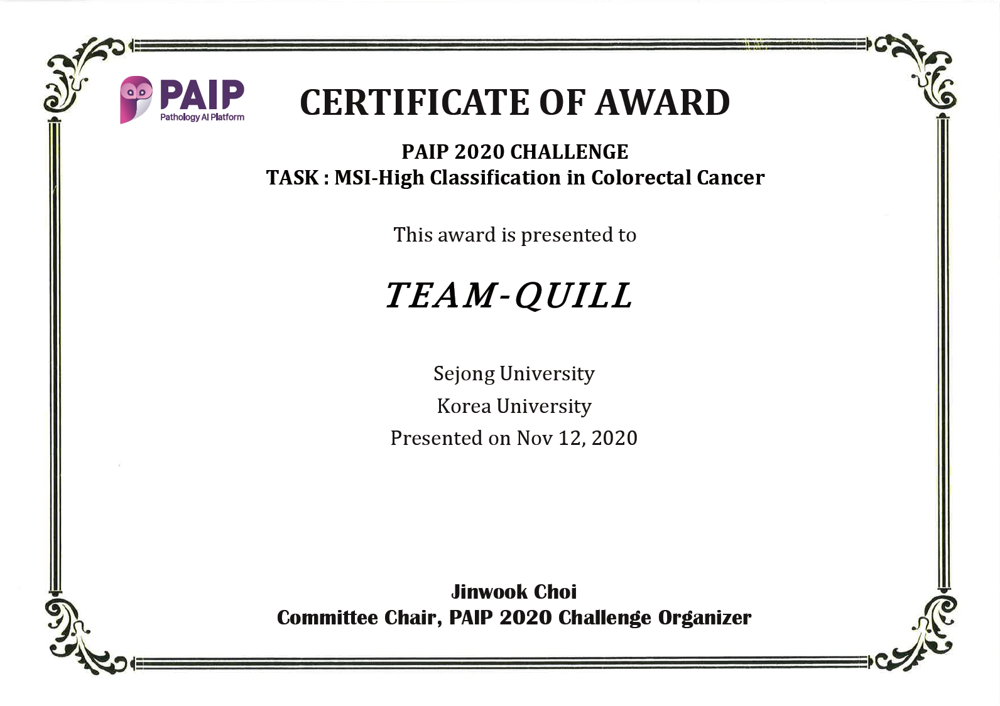

<!-- PROJECT LOGO -->
<p align="center">
    <a href="https://paip2020.grand-challenge.org">
        
    </a>
    <h3 align="center">PAIP2020</h3>
    <p align="center"> 
        PAIP2020 is the second challenge organized by the Pathology AI Platform (PAIP) <br>and the Seoul National University Hospital (SNUH).
    <br>
        <a href="https://paip2020.grand-challenge.org"><strong>PAIP2020 homepage</strong></a>
    </p>      
</p>


<!--Table of Contents--!>

<strong>Table of contents</strong>
<details open="open">
    <ol>
        <li>
            PAIP2020 Challenge
            <ul>
                <li>background</li>
                <li>dataset</li>
                <li>evaluation</li>
            </ul>
        </li>
        <li>
            Our method
            <ul>
                <li>Task1.MSI-H classification</li>
                <li>Task2.Whole tumor segmentation</li>
            
            </ul>
        </li>
       
        <li>
            prerequisites
        </li>
    </ol>
</details>


<!--PAIP2020 challenge-->
## PAIP2020 Challenge

<ul>
    <li>
        <strong>background:</strong>
        <p>Microsatellite instability (MSI), caused by a defective DNA mismatch repair system, has both prognostic and therapeutic implications in colorectal cancer (CRC).MSI is determined by using five microsatellite markers, including D2S123, D5S346, D17S250, BAT25, and BAT26.
        <ul><li>MSI-High (MSI-H; instability at ≥ 2 microsatellite markers)</li>
            <li>MSI-Low (MSI-L; instability at 1 marker)</li>
            <li>MSI-Stable (MSS; microsatellite stable or no instability)</li></ul>
        </p>
    </li>
    <li>
        <strong>dataset</strong></li>
        <p>
           a  
        </p>
    <li>
        <strong>evaluation</strong>
        <ul>
            <li>Evaluation Step #1: MSI prediction accuracy (quantitative assessment)</li>
            <li>Evaluation Step #2: Colorectal tumor segmentation accuracy (qualitative assessment)</li>
        </ul>
    </li>
 

</ul>


<!-- ABOUT THE PROJECT -->
## Our method
<p align="center">
    
    <h5 align="center">Figure1.Overview</h5>
</p>
<ol>
    <li><strong>Task1.MSI-H classification</strong>
        <p>
             Task1 includes 3 different kinds of images, including the original WSIs, tissue masks for the WSIs, and tumor masks for the WSIs. The tissue masks are generated by using a threshold value (220, 200, 220) in RGB. The tumor masks are supplied either by ground truth or by Task2.All the tissue masks, tumor masks, and original WSIs are resized to x5 magnification. Using the tissue and tumor masks, tumor tiles of size 256x256 pixels are created as long as the tiles possess >80% of tumor area and >60% of tissue area. Given the tumor tiles of each WSI, N2 tiles (N=10) are randomly selected and undergo image augmentation, including scaling, translating, and shearing. Then, the tiles are cropped to the size of 128x128 pixels. The N2 tiles are reshaped into a rectangular image patch of size 1280x1280 pixels and used to train a CNN model (efficientnet-b0) for MSI-High classification. During testing, 1000 image patches are generated for each WSI and the CNN model classify the patches. Summarizing the results via majority voting, we predict the class label for the WSI. 
        </p>
    </li>
   
    
  <li><strong>Task2.Whole tumor segmentation</strong>
    <p>
        As in Task1, using the original WSIs and tissue and tumor masks for the WSIs, image patches of size 1024x1024 pixels are generated. The image patches are required to possess &#62;60&#37; of tissue area. If the patches have >80% of tumor area, then they are designated as tumor. If the patches contain &#60;20% of tumor area, then they are labeled as benign.Using efficientnet-b2, the patches are classified into tumor and benign. To generate a tumor mask, a sliding window with a step size of a half of the patch size is applied. Summarizing the results, we obtain a probability map for tumor segmentation.
    </p>
  </li>
    

</ol>

<!--prerequisites-->
## prerequisites
* imgaug
  ```sh
  pip install imgaug
  ```
* torch
  ```sh
  pip install torch
  ```
* openslide-python
  ```sh
  pip install openslide-python
  ```
* tifffile
  ```sh
  pip install tifffile
  ```


<!--certification-->
## certification
<p align="center">
    

</p>


